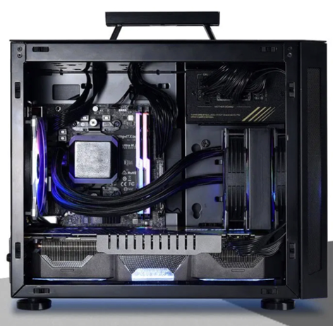

# AI Racing League Purchasing Guide

## DonkeyCars

### Microcontrollers

#### Raspberry Pi

#### NVIDIA Nano

## GPUs

!!! Note
    The AI Racing League ONLY uses this for training our models.  We don't need elaborate CPU overclocking and a water cooled CPU.  We don't need powerful CPU and lots of RAM.  We just need to be able to train a 20K image model within around 5-10 minutes.  Most GPUs can do this.

### Portable Case

We wanted a small lightweight case with a handle and tempered glass sides so our teams can see what is inside.  The price is around $110.00.

[Lian Li TU150 Mini ITX Desktop Case](https://lian-li.com/product/pc-tu150/?cn-reloaded=1)

### Motherboard

### RAM

### GPU

### Solid State Drive