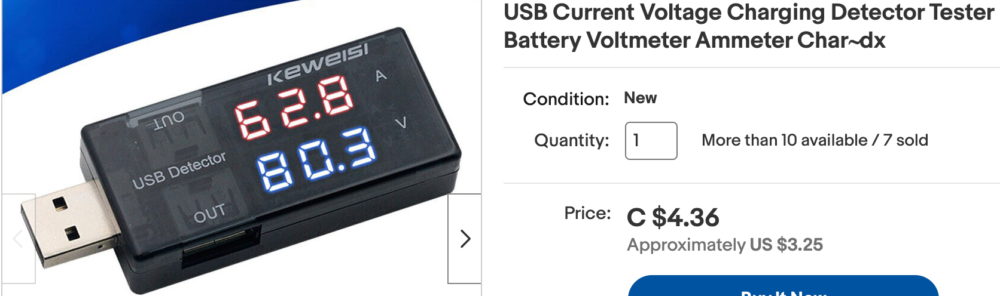

# AI Racing League Tools

Here are some handy tools to help you with your cars.

## USB Voltage Current Meter

Many USB battery packs don't maintain a voltage of 5.1v when under load.  To monitor this, you need to
watch the voltage level that arrives at the single-board computer input voltage.  This needs
to include any voltage drop over the USB power cable.

Sample [item on e-Bay](https://www.ebay.com/itm/285163085863)

This item uses a four semi-double loop integral converter ICs, with a precision bandgap reference.  The vendor claims
the device has:

1. range accuracy and high precision
2. stable and reliable performance
3. strong anti~interference ability
4. tolarance for high temperatures

Specifications:

1. Current range: 0~5A
2. Voltage range : 3 ~ 7.5V 
3. Resolution : Voltage 10mV, current 1mA
4. Error: voltage <± 1% current <± 2%
5. Voltage drop when measuring current: 200mV

Note the voltage drop when current is passing through the device.  
In practice, the exact voltage drop varies with the current.  For a typical
project drawing 300 milliamps, the voltage drop is around 100vV.

