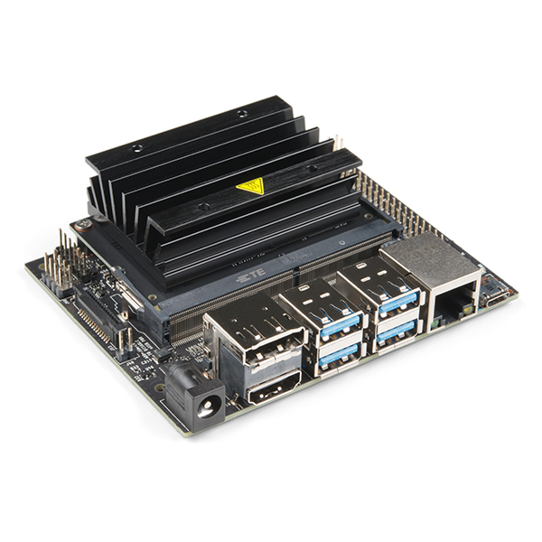

# Navidia Jetson Nano
Dan McCreary Dan.McCreary@gmail.com
v0.1
:type=beginner
:side=front

[#img-nano]
.The Nvidia Jetson Nano Sigle Board Computer

.Here are the key parts of the Nano:
[horizontal]
Price:: $96 USD
CPU: Quad-core ARM® A57
GPU:: 128-core NVIDIA Maxwell™ architecture-based GPU
Memory:: 4 GB 64-bit LPDDR4; 25.6 gigabytes/second
USB:: 4 USB A and 1 USB C for power
HDMI:: High Definition Media Interface
Video:: 4K @ 30 fps (H.264/H.265) / 4K @ 60 fps (H.264/H.265) encode and decode
Camera:: MIPI CSI-2 DPHY lanes, 12x (Module) and 1x (Developer Kit)
Network:: Gigabit Ethernet (No WiFi or USB)