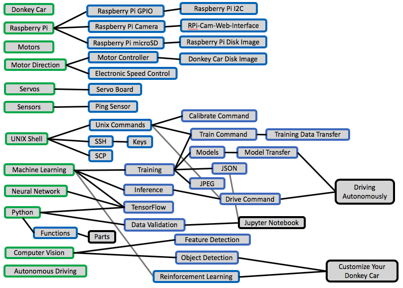

# Curriculum

We have a long term vision of using an intelligent agent that will recommend the right content for each of our students based on their current knowledge and their learning goals.

## Beginning (Green) Concepts

### Batteries
### Motors
### Donkey Car
### Activity
Go to the donkey car station and look at the sample Donkey Car. Ask a mentor to show you the parts.
### Questions

1) What are the key parts of the Donkey Car?

  
The key parts are:
* RC Car chassis
* Nvidia Jetson Nano
* Servo controller
* Camera
* Battery for the Nano

2) How do the front wheels turn?

A 180 degree servo is used to steer the car

3) Can you find an electric motor?

There is only a single motor in the RC chassis

4) Can you find a battery?  Are their multiple batteries?

  
There are two batteries - one for the motor and one for the Jetson Nano

5) Where is the Jetson Nano (computer)?

It is right on top!

6) Where is the camera?  Is it on the front or back of the car?

The camera is on the top facing forward

7) What happens to the opposite wheel when you turn it?

The transmission makes the wheels turn in opposite direction when one wheel is turned. - Is this correct?

8) How much does a Donkey Car cost?

  
The car costs around $250 each.  The RC chassis cost about $110.

9) Why do you think they call it a “Donkey Car”?

They call it a "Donkey Car" because, like a Donkey, it is functional but not very sleek.

----------------------------------------------------

### Intermediate Concepts
### Machine Learning
#### Activity
Go to the machine learning station and watch the demos. Ask about the difference between if-else statements and machine learning.
#### Questions

1) What is Machine Learning? How does it differ from traditional rule-based programming?

  
Machine learning is a method of data analysis that automates analytical model building, based on the idea that systems can learn from data. Rule-based programming is built off of if-else statements in code, and therefore every possible situation has to be thought of in advance by the programmer. Therefore, machine learning is well suited for situations where all possible inputs may not be defined.

2) How does a computer learn?

The computer learns through a process called training. Training is the process of adjusting a mathematical formula by feeding it data and adjusting the formula until it produces the desired output.

3) What are the major groups of machine learning?

  
There are 5 major groups of algorithms within machine learning.  They are:
* The connectionists (Neural Networks)
* The analogizers (Support Vector Machines)
* The Bayesians (Bayes’ Theorem)
* The evolutionaries (Genetic Algorithms)
* The symbolists (Inverse Deduction)

4) Applications of machine learning are everywhere, what are some examples?

Some applications of machine learning are:
* Voice Assistants (Siri, Alexa, etc.)
* Translation
* Self-Driving Cars

------------------------------------

# Blue Concepts

# Black Concepts
