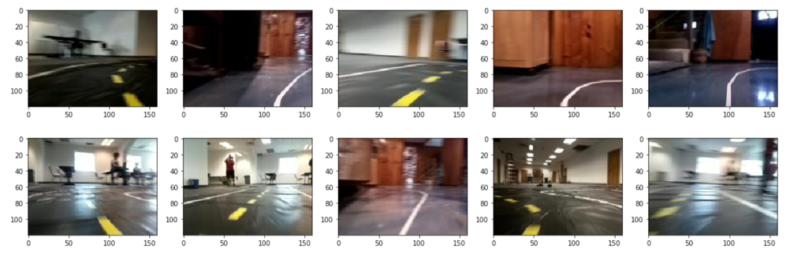

# Working with Files


## Listing Files with the OS library
Python provides a powerful library for working with Operating System resources like file systems.  We will start out with the ```listdir()``` function that lists the files in a directory.

Here is program that lists all the tub files in our mycar/data directory:

```python
import os
data_dir = "/home/arl/mycar/data/"

files = os.listdir(data_dir)
for file in files:
    print(file)
```

returns:

```
a-test-tub
my-test-tub
junk-tub
production-run
tub-47
```

## Listing Files in a 

```python
import os
from IPython.display import Image

image_dir = "/home/arl/mycar/data/dans-msp/data/images"

files = os.listdir(image_dir)
# last basement image is 1710
n = 1710
file_n = files[n]
file_2 = files[n+1]
print(n, file_n)
file_path1 = image_dir + '/' + file_n
file_path2 = image_dir + '/' + file_2
i1 = Image(file_path1)
i2 = Image(file_path2)
print(n+1, file_2)

display(i1, i2)
```

## List Random Files In Images Directory

```py
import os
import matplotlib.pyplot as plt
from IPython.display import Image

image_dir = "/home/arl/mycar/data/dans-msp/data/images"
image_file_name_list = os.listdir(image_dir)

for index in range(0,10):
    file_name = image_file_name_list[index]
    print(file_name)
```

returns:

```
10263_cam_image_array_.jpg
6257_cam_image_array_.jpg
15248_cam_image_array_.jpg
3916_cam_image_array_.jpg
5223_cam_image_array_.jpg
15765_cam_image_array_.jpg
8437_cam_image_array_.jpg
5871_cam_image_array_.jpg
16681_cam_image_array_.jpg
15281_cam_image_array_.jpg
```

Note that the files are not in any specific order.

## Show Images for 10 Random Files

```
import glob
import matplotlib.pyplot as plt
import matplotlib.image as mpimg
%matplotlib inline

images = []
for img_path in glob.glob('/home/arl/mycar/data/dans-msp/data/images/*.jpg'):
    images.append(mpimg.imread(img_path))

plt.figure(figsize=(20,10))
columns = 5
for i, image in enumerate(images):
    plt.subplot(len(images) / columns + 1, columns, i + 1)
    plt.imshow(image)
```



## Sorting Images By File Name

We can add an additional step if we want to sort the images by the file name:

```py
image_file_name_list = os.listdir(image_dir)
image_file_name_list.sort()
```

## Return Images Based On Creation Date

```py
import os
import matplotlib.pyplot as plt
from IPython.display import Image
from pathlib import Path

image_dir = "/home/arl/mycar/data/dans-msp/data/images"
paths = sorted(Path(image_dir).iterdir(), key=os.path.getmtime)

images = []
# just get the first 10 items in the list of images
for path in paths[:10]:
    print(path)
    images.append(mpimg.imread(path))
    
plt.figure(figsize=(20,10))
columns = 5
for i, image in enumerate(images):
    plt.subplot(len(images) / columns + 1, columns, i + 1)
    plt.imshow(image)
```