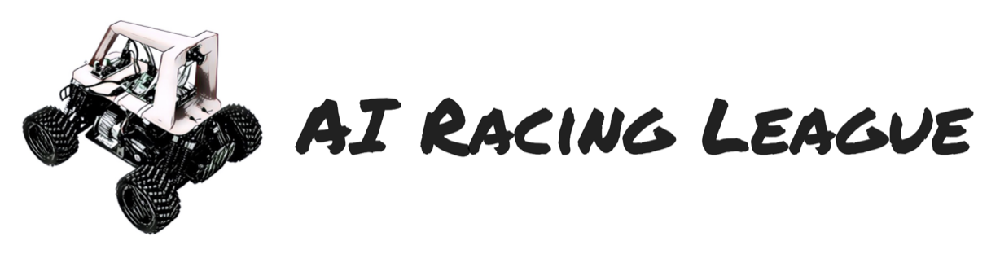

# Welcome to the AI Racing League

*Promoting equity and innovation in AI education.*

The AI Racing League is a fun way to learn the concepts behind artificial intelligence!  We learn AI by teaching small RC-cars to drive around a track autonomously.  The cars use a low-cost Raspberry Pi (or NVIDIA Nano) with a camera.  Students drive around the track and gather a set of images to "train" a neural network that can be used to automatically steer the car.

In addition to teaching machine learning, this course also teaches concepts like Python programming, computer vision, and data science. Our curriculum is inspired by the [DonkeyCar](glossary#donkey-car) and the [CoderDojo](glossary#coder-dojo) mentoring system.

Our secret sauce is to combine the right hardware, software, mentors and a flexible learning curriculum to create fun events that students love to participate in.

## Current Status

We have postponed our in-person events until after the safety issues with COVID-19 have passed.  We are still working on creating new educational content and getting ready for a strong post-pandemic kickoff event in late 2021.

## Mission
The mission of the AI Racing League is to create and deliver educational materials that will make fun AI training accessible to everyone. We place a special focus on students from disadvantaged communities including women and minorities.  We  work as a sub-project of the CodeSavvy not-for-profit organization and we adhere to their guidelines for quality and security of our students.  This means that all our volunteers have background checks and we limit the student to mentor ratios to no more than three students per mentor.  We are committed to equal opportunity mentoring.  We strive to recruit, train and retain the best mentors we can find.

We are inspired by the values behind the CoderDojo mentoring system and their innovative use of flexible [concept cards](glossary#concept-cards).  We attempt to publish concept cards that provide a flexible and agile training environment for a wide variety of learners.

## Checkout Our Site:

* **Education Material:** If you would like to teach AI Racing in the classroom, at a meetup or even in a corporation check out our [resources here](resources.md)
* **Resources:** Want to connect or contribute to the community check us out [here](resources.md)
* **About us:** Want to know more about us? [Check us out](about.md)
