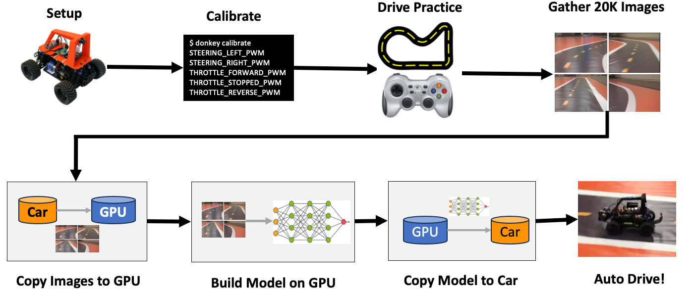

# Welcome to the AI Racing League

*Promoting equity and innovation in AI education.*

The AI Racing League is a fun way to learn the concepts behind artificial intelligence!  We learn AI by teaching small remote-controlled (RC) cars to drive around a track autonomously.  The cars use a low-cost Raspberry Pi computer (or NVIDIA Nano) with a camera.  Students drive around the track and gather a set of images to "train" a neural network that can be used to automatically steer the car.

In addition to teaching machine learning, this course also teaches concepts like Python programming, computer vision, data science and generative AI. Our curriculum is inspired by the [DonkeyCar](glossary#donkey-car) and the [CoderDojo](glossary#coder-dojo) mentoring system.  We feature a wide variety of lesson plans from the 5th grade up to college-level participants.

Our secret sauce is to combine the right hardware, software, mentors and a flexible learning curriculum to create fun events that students love to participate in.

## Current Status

We are in the process of restarting our events starting in the fall of 2023.  Please contact [Dan McCreary](https://www.linkedin.com/in/danmccreary/) if you would like to participate.

The following organizations have expressed an interest in helping out:

1. [Code Savvy](https://www.codesavvy.org/) - Contact: [Valarie Lockhart](https://www.linkedin.com/in/valockhart/) - The AI Racing League runs as a project under Code Savvy.  They are a 503C not-for-profit organization.
2. [Minneanalytics](https://minneanalytics.org/) - Contact: [Dan Atkins](https://www.linkedin.com/in/danalytics/) - contact Dan Atkins directly if you are looking for funding for your team.
3. [Washburn High School]() - Contact: [Peter Grul](https://www.linkedin.com/in/peter-grul-785ab66/)
4. [Best Buy Education](https://www.bestbuy.com/site/bestbuy-business/bestbuy-education) - Contact: [Wes Strait](https://www.linkedin.com/in/wesstrait/) - Wes and his team have run several events using the Amazon deep racer.
5. [Minnesota STEM Partnership](https://mnstempartners.org/) - Contact: [Michael Wulf](https://www.linkedin.com/in/mgwulf/) - Michael created his first AI Racing League team in the summer of 2021.
6. [Create Minneapolis](https://www.creatempls.org/) Contacts: [Krista Stommes](krista@creatempls.org) and Rob

## Mission

The mission of the AI Racing League is to create and deliver educational materials that will make fun AI training accessible to everyone. We place a special focus on students from disadvantaged communities including women and minorities.  We work as a sub-project of the CodeSavvy not-for-profit organization and we adhere to their guidelines for the quality and security of our students.  This means that all our volunteers have background checks and we limit the student-to-mentor ratios to no more than three students per mentor.  We are committed to equal-opportunity mentoring.  We strive to recruit, train and retain the best mentors we can find.

We are inspired by the values behind the CoderDojo mentoring system and their innovative use of flexible [concept cards](glossary#concept-cards).  We attempt to publish concept cards that provide a flexible and agile training environment for a wide variety of learners.

We believe strongly in student-led initiatives and project-based learning.  We feel students learn the most when they are building things together in teams.  We believe our curriculum should be broad to support a wide variety of students from begging Python to advanced AI.

Rather than force students down a single path of learning, we believe our instructors should be more like travel guides to help students explore their areas of interest.  Our curriculum needs to adapt to single-hour events up to multi-year mentoring.  See [Rhizomatic Learning](https://en.wikipedia.org/wiki/Rhizomatic_learning) for what inspires us.

## Checkout Our Other Sites:

* [AI Racing League](https://www.coderdojotc.org/ai-racing-league/)
* [Beginning Python](https://www.coderdojotc.org/python/)
* [MBOT]
* [MicroPython for Kids](https://www.coderdojotc.org/micropython/)
* [ChatGPT for Teachers](http://www.coderdojotc.org/chatgpt-for-teachers/)
* [AI for Kids](https://github.com/CoderDojoTC/ai)
* [MBOT](https://www.coderdojotc.org/mbot/)
* [IoT Hackday](http://www.coderdojotc.org/iot-hackday/) - costume contest

## Other Resources

* **Education Material:** If you would like to teach AI Racing in the classroom, at a meetup or even in a corporation check out our [resources here](resources.md)
* **Resources:** Want to connect or contribute to the community check us out [here](resources.md)
* **About us:** Want to know more about us? [Check us out](about.md)
