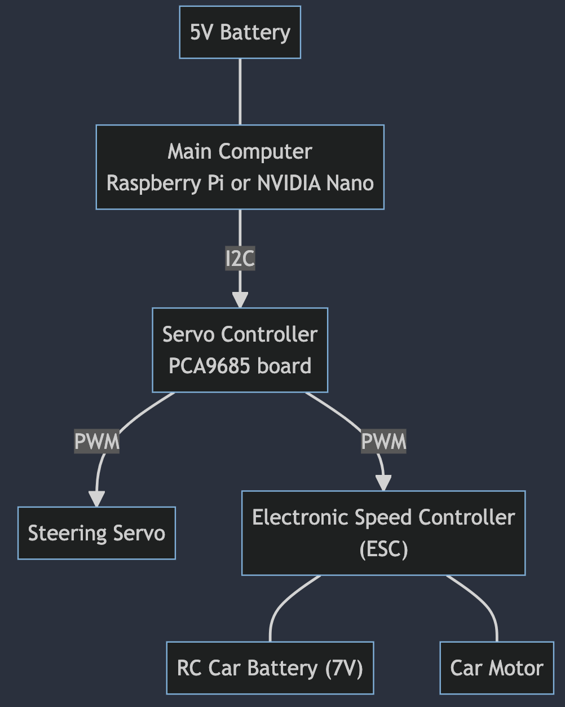
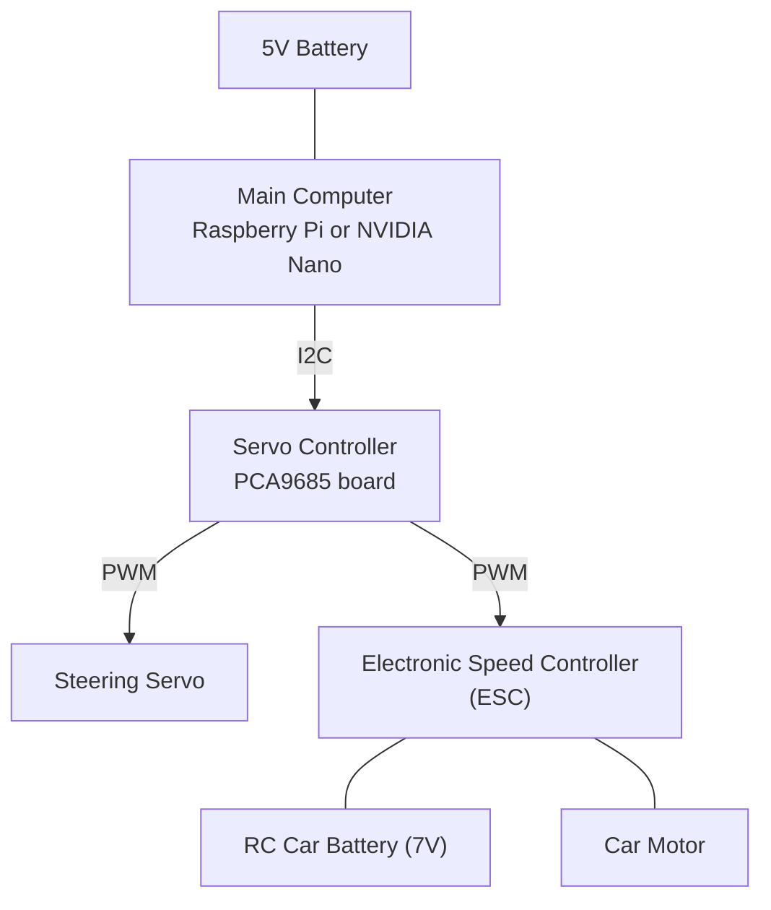

# RC Car Structure

## Lesson Plan Goals

This lesson puts a focus on getting students familiar with the parts of the Donkey Car including:

1. RC Car Chassis
2. RC Car Motor
3. RC Car Battery
4. RC Car Steering Servos
5. PWM Card
6. Raspberry Pi
7. Raspberry Pi Power Supply
8. Raspberry Pi Battery
9. Raspberry Pi Camera
10. The F710 Joystick



## Using GPTChat To Help Generate Block Diagrams

Generating architecture diagrams can be a slow and painful process.
But ChatGPT can help.  here is a process of generating a block diagram
using ChatGPT.  We can use the [Mermaid Live](https://mermaid.live/) program to view the diagram.  ChatGPT also has a ```diagram``` plugin that will render the image within ChatGPT.

## GPTChat Prompt

```linenums="0"
Create a mermaid block diagram for the structure of a Donkey Car.  Make sure to label all the components and their connection types.  Return the results in raw mermaid format.  Include the following structures:

1. The main computer (Raspberry Pi or NVIDIA Nano)
2. The main computer has an I2C connection to the Servo Controller board
3. The Servo Controller connects to the Steering Servo and the Electronic Speed Controller (ESC) via PWM connections
4. The ESC connects to the RC Car Battery
5. THE ESC connects to the Car Motor
6. The 5v battery powers the main computer
7. There are two batteries: a 5V battery and a 7V RC Car Battery.
8. The Servo controller is a PCA9685 board.
```

## ChatGPT Response

```
This code will create a block diagram where:

The "Main Computer" (A) connects to the "Servo Controller" (B) via an I2C connection.
The "Servo Controller" (B) connects to both the "Steering Servo" (C) and "Electronic Speed Controller" (D) via PWM connections.
The "Electronic Speed Controller" (D) connects to both the "RC Car Battery" (E) and the "Car Motor" (F).
The "5V Battery" (G) connects to the "Main Computer" (A) as well as to the "Positive Connection" (H) and "Negative Connection" (I).
The "RC Car Battery" (E) also connects to both the "Positive Connection" (H) and "Negative Connection" (I).
Please note that this is a simplified diagram and does not necessarily represent the physical arrangement of the components in an actual Donkey Car setup. This diagram should be taken as an abstract representation of how the components interact.
```

## Mermaid Diagram

