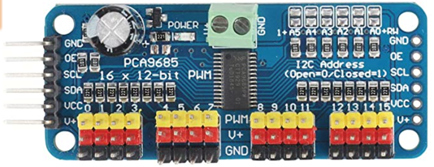
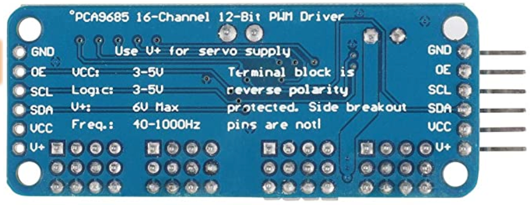
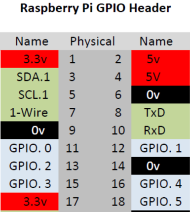
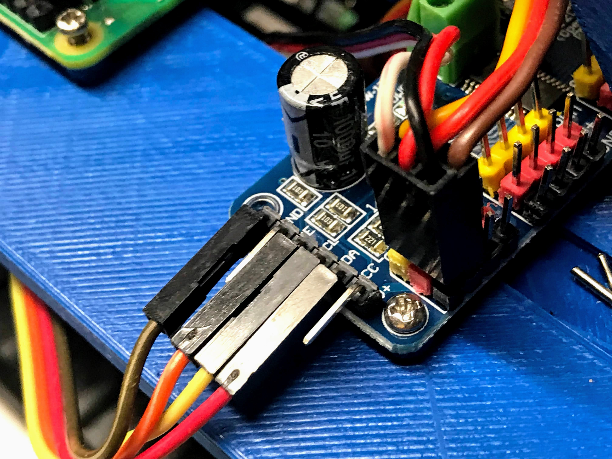

# PWM Board Deep Dive

The DonkeyCar uses the low cost PCA9685 PWM board.

## PCA9685 PWM Board

## Pi 40 Pin Header

## Connections

## References

* [Connections Handown (PowerPoint)](slides/Connecting-PWM-Cards.pptx)
* [Using a PCA9685 module with Raspberry Pi](https://www.aranacorp.com/en/using-a-pca9685-module-with-raspberry-pi/)