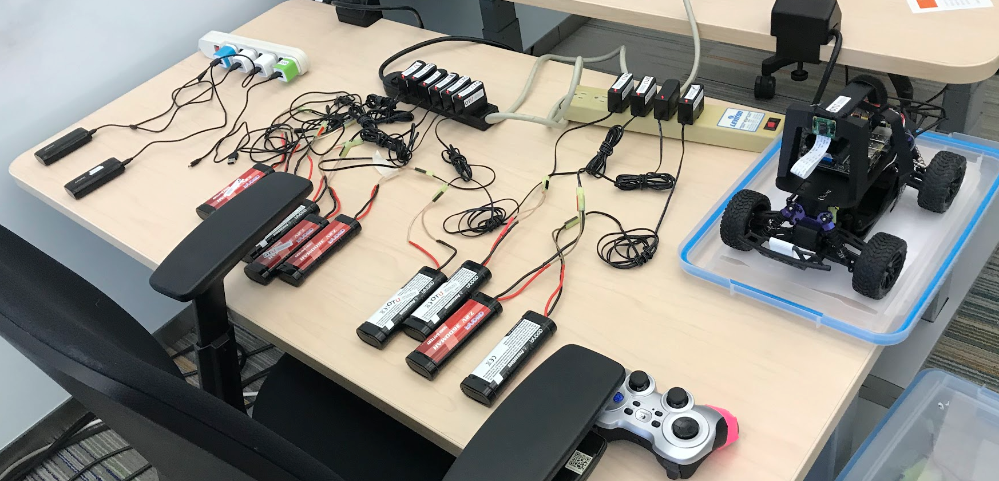

# Battery Options

Getting batteries charged before each event requires some strong organizational skills.  Although the LiPo batteries retain a charge
for a long time, the RC car batteries must be fully charged the
night before each event.

## Computer Batteries

We used several Ankar 2,000 milliamp-hour batteries for powering the
cars.  The batteries would last for the entire single-day events as long
as they were charge before the event and not used to power the
cars when not running on the tracks.

## RC Car Batteries

## Battery Cables

Several participants used long battery cables with a small wire gauge.  These cables caused voltage drops that made the cars stop working.  We told all teams to use short 8-inch battery cables and most of these problems went away.

[Sample 1ft Charging Cable](https://www.amazon.com/Durable-Charging-Station-Compatible-Samsung/dp/B08PXWYKTB/ref=sr_1_3)

