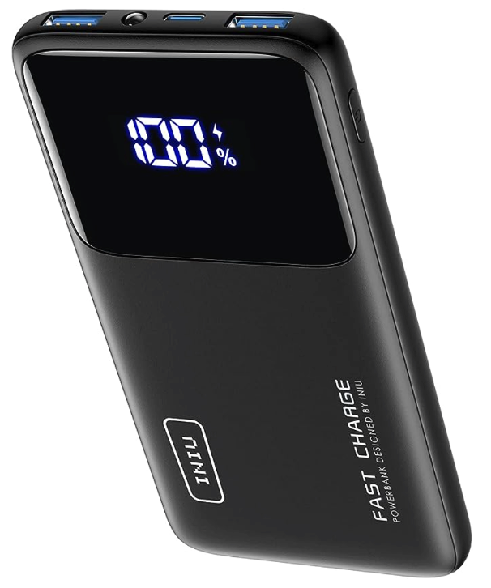
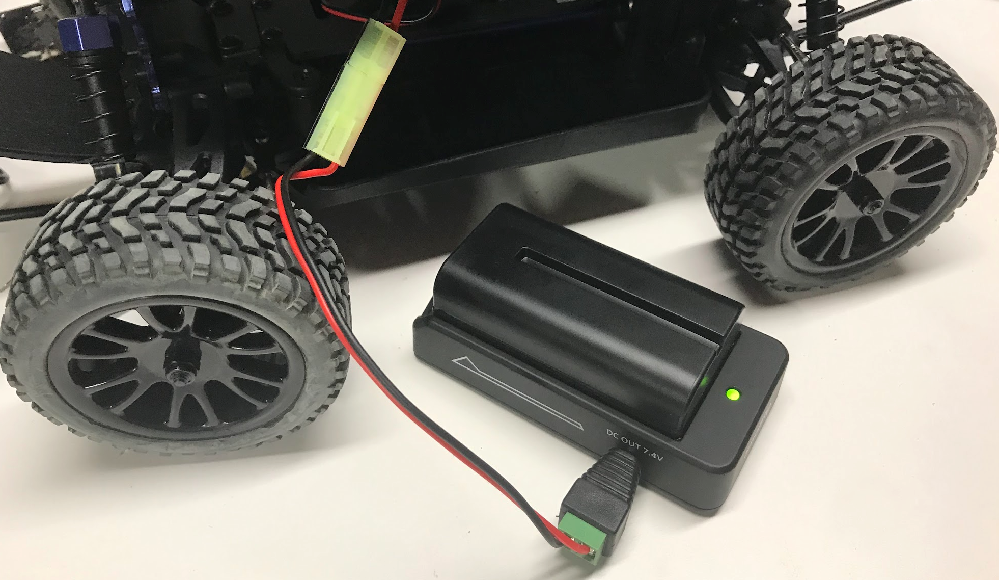
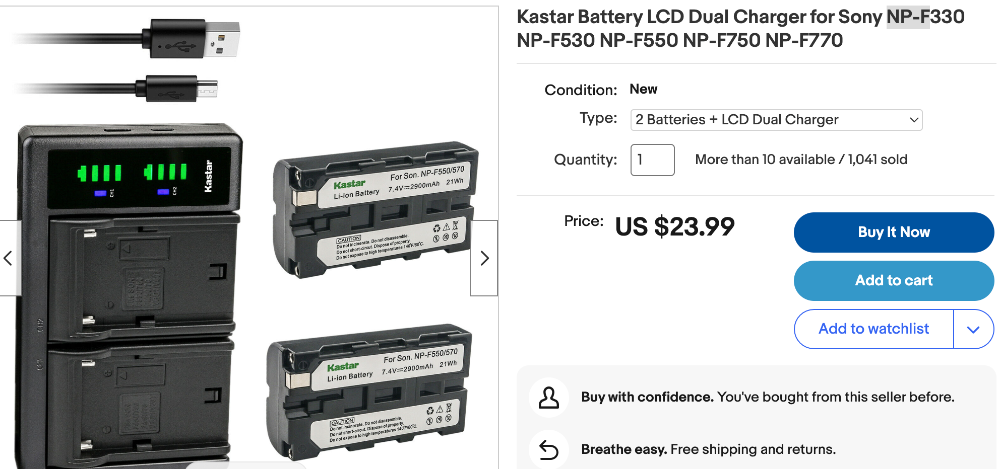

# Battery Options

## Dual Batteries

In general, most of our cars use two separate batteries:

1. One battery for the power to the drive motors and steering servos
2. One battery to power the single-board computer and power the sensors like the camera

Getting batteries charged before each event requires some strong organizational skills.  Although the LiPo batteries retain a charge for a long time, the RC car batteries must be fully charged the
night before each event.

## 18650 Standards

The 18650 is a standard cell size for 3.7 volt Lithium batteries (18mmX65mm).  The problem
is that if these batteries go below 3.2 volts they become damaged and can't be recharged.
This is why you should never use these batteries without charge protection circuits.

A typical 18650 battery produces 4.2 V when fully charged with a nominal voltage of 3.7 V.

The [TP4056](https://www.amazon.com/dp/B01LHD9D7E) is a low-cost charger chip for one (1) cell. If you plan to charge multiple cells simultaneously, each charging slot for a cell needs its own TP4056.

!!! Warning
    Never connect a 5V power supply directly to a lithium cell. Even though the cells have built-in protection, they are not chargers. It is the last line of protection to prevent catastrophic failures by disconnecting the cell under abnormal conditions - unless the protection does not work.

## Boost and Buck Converters

These are low-cost DC-to-DC voltage converters that allow you to use standard 3.7-volt cells that drive a 5-volt system.  Boost converters increase the voltage and buck converters lower the voltage.  You can purchase basic devices for $2, but fancier versions have displays that show both the input and output voltages.

1. [Boost Converters on eBay](https://www.ebay.com/sch/i.html?_nkw=Boost+Converter)
2. [Buck Converters on eBay](https://www.ebay.com/sch/i.html?_nkw=buck+Converter&_sacat=0)

## Computer Batteries

We initially used several Ankar 2,000 milliamp-hour batteries for powering the
cars.  The batteries would last for the entire single-day events as long
as they were charged before the event and not used to power the
cars when not running on the tracks.  The batteries typically could be
recharged over 100 times before they had to be replaced.

Many teams use larger (and heavier) 10,000 milliamp-hour Lithium batteries.  These
are especially useful when learning to drive around the track.  Teams also loved
the fact that the INIU batteries showed the percent power remaining.

The [INIU Portable Charger, Slimmest 10000mAh 5V/3A Power Bank](https://www.amazon.com/dp/B07CZDXDG8) is also a popular choice since they only cost about $19.

## Traditional RC Car Batteries

The traditional RC car batteries are based on standard "Safe" battery chemistry that can be fully drained and are not a strong fire hazard.  The problem is that they
take a long time to charge (typically overnight) and they don't store a lot of power so they typically only last a few minutes at high speed.

## Camera LiPo Batteries

A newer option is lower-cost rechargeable camera batteries that are built around 
the Sony NP-F standard.  These are widely regarded as safe by the camera industry
and there are many low-cost smart batteries and chargers available for around $10 each. They produce a stable 7.4-volt output that is perfect for our DC motors
in RC cars.

The only consideration is getting cables that convert the batteries to use the RC car standards.  I have made my own cables, but the quality of the connectors on the Donkey Car still leaves some things to be desired.  The ends of the connectors are easy to pull off.  I think that soldering a new barrel connector on all the RC cars
might be another option.

The one other challenge is trying to find a low-cost connection plate.  Right now the lowest cost plate is about $27 on Amazon.  I hope we can find lower-cost options.

[Two batteries and charger on e-Bay for $23](https://www.ebay.com/itm/254450799703)

[Neewer Battery Connection Plate for $27 on Amazon](https://www.amazon.com/Mirrorless-Indicators-5-5x2-5mm-5-5x2-1mm-Compatible/dp/B0BRQGGVX4)

The camera industry has also developed standard 7.4-volt battery packs that
enclose low-cost 18650 battery cells.  These standards have electronics built in
to protect from drainage. Here is a list of parts that were recommended by the NVIDIA Jetson Hacks team:

1. [SmallRig NP-F Battery Plate Adapter](https://amzn.to/3MyHwCw)
1. [Generic NP-F 550 2 Cell Battery](https://amzn.to/3kgEsi5)
1. [Generic NP-F 750 4 Cell Battery](https://amzn.to/3vgePo4)
1. [Antigravity Micro-Start XP-1 Battery](https://amzn.to/3LwDbiQ)
2. [Artman NP-F550 Battery and Dual USB Charger for Sony NP F550, F570, F530, F330, F970, F960, F750, F770, CCD-SC55, TR516, TR716, TR818, TR910 (2-Pack 2900mAh)](https://www.amazon.com/Artman-Set-Compatible-CCD-SC55-TR940%EF%BC%882-Pack-Charger%EF%BC%89/dp/B07P7W2W1T/ref=psdc_281407) - great deal - two batteries and charger for $28.99
3. [Kastar Battery LCD Dual Charger for Sony NP-F330 NP-F530 NP-F550 NP-F750 NP-F770](https://www.ebay.com/itm/254450799703) - - two batteries and charger for $28.99

## Battery Cables

Several participants used long battery cables with a small wire gauge.  These cables caused voltage drops that made the cars stop working.  We told all teams to use short 8-inch battery cables and most of these problems went away.  We strongly suggest you build your own cables and use 18-gauge wire.

[Sample 1ft Charging Cable](https://www.amazon.com/Durable-Charging-Station-Compatible-Samsung/dp/B08PXWYKTB/ref=sr_1_3)

## Connectors and Crimping Tool

* [Ferrule Crimping Tool Kit](https://www.amazon.com/dp/B073TZ5BBG)

## Camera Batteries

## 7.4 Volt LiPo Batteries

[1500mAh 7.4V 2S 18650 Battery](https://www.ebay.com/itm/394666724323?_trkparms=amclksrc%3DITM%26aid)

## References

[NVIDIA Jetson on Battery Power](https://www.youtube.com/watch?v=B4afWen1CsY) - a nice video by 
