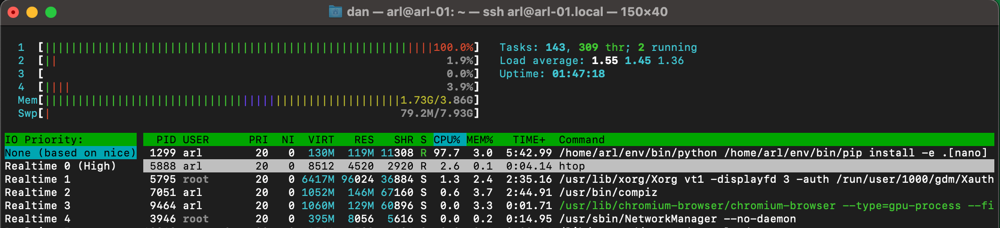

# Building an AI Racing League Image for the Car

This process takes about four hours and requires close attention to detail.

## Install The Latest NVIDIA image

## Enable SSH

This allows you to do a remote login to the car

```sh
sudo systemctl enable ssh
sudo systemctl start ssh
```

Test ssh:

```sh
ssh arl@arl-01
```

```
Welcome to Ubuntu 18.04.6 LTS (GNU/Linux 4.9.253-tegra aarch64)

 * Documentation:  https://help.ubuntu.com
 * Management:     https://landscape.canonical.com
 * Support:        https://ubuntu.com/advantage
This system has been minimized by removing packages and content that are
not required on a system that users do not log into.

To restore this content, you can run the 'unminimize' command.

Expanded Security Maintenance for Infrastructure is not enabled.

0 updates can be applied immediately.

Enable ESM Infra to receive additional future security updates.
See https://ubuntu.com/esm or run: sudo pro status
```

## Add a swap file

The Jetson Hacks GitHub repo contains a nice UNIX script that
will add a swap file.

```sh
git clone https://github.com/JetsonHacksNano/installSwapfile
cd installSwapfile
./installSwapfile.sh
```

You should reboot the Nano after you add this file.

## Add HTOP

The standard UNIX ```top``` command does not display the load across multiple cores.  The much
more modern ```htop``` is preferred and has better use of color.

```sh
sudo apt-get install htop
```
## Customize Browser Add the Bookmark Bar

1. AI Racing League
2. Donkey Car Docs

## Remove Unused Software

Ubuntu comes with several "Office" applications for doing word-processing, spreadsheets and presentations.  These applications take up a lot of disk space so we will remove them.

```sh
sudo apt-get remove --purge libreoffice*
sudo apt-get clean
sudo apt-get autoremove
```

## Upgrade Local Libraries

## Download Donkey Car Dependencies


sudo apt-get update -y
sudo apt-get upgrade -y
sudo apt-get install -y libhdf5-serial-dev hdf5-tools libhdf5-dev zlib1g-dev zip libjpeg8-dev liblapack-dev libblas-dev gfortran
sudo apt-get install -y python3-dev python3-pip
sudo apt-get install -y libxslt1-dev libxml2-dev libffi-dev libcurl4-openssl-dev libssl-dev libpng-dev libopenblas-dev
sudo apt-get install -y git nano
sudo apt-get install -y openmpi-doc openmpi-bin libopenmpi-dev libopenblas-dev

## Monitoring Activity



## Version Checks

```sh
pip3 --version
```

```
pip 21.3.1 from /home/arl/env/lib/python3.6/site-packages/pip (python 3.6)
```
