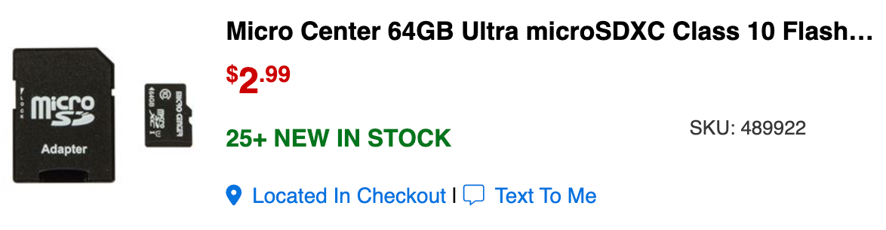

# Selecting the Right MicroSD Card

## Size

Although you can boot the Raspberry Pi and NVIDIA Nano on a 16GB microSD card, it will quickly run out of room after you download the 36K Python libraries.  Our suggestion is to use a minimum of a 64 GB card and ideally a 128 GB microSD card.



In the item above, the "Class 10" indicates it will write above 10 MB/sec.

## Bandwidth Calculation for 224x224 Color Images

What speed microSD card should you purchase?  Low-cost cards write at 10 MB/sec and more expensive cards can run up to 100 MB/sec.  What one should we purchase?

The default image for the Donkey Car is 224x224 color images.

### Analysis

Calculate the total microSD card write bandwidth needed for a camera that reads 224x224 color images and needs to write 20 images per second to the disk.

### Step-by-Step Calculation

### Step 1: Calculate the Size of a Single Image

A 224x224 color image would have 224 * 224 = 50,176 pixels.

Assuming the image uses a standard RGB color scheme, each pixel would have three color channels: Red, Green, and Blue. Each channel typically requires 1 byte (or 8 bits) to store its intensity value. So, each pixel would need 3 bytes.  The size of a single image would be:

```linenums="0"
Size of a single image = Number of pixels * Bytes per pixel

= 50,176 pixels * 3 bytes/pixel
= 150,528 bytes/image
= 150 KB
approx 0.147 MB
```

### Step 2: Calculate the Total Bandwidth Needed Per Second

We are writing 20 images a second to the disk, so the total bandwidth needed per second would be:

```linenums="0"
Total bandwidth per second = Size of a single image * Number of images per second

= 0.147 MB * 20
= approx 2.94 megabytes/s
```

## Conclusion

The microSD would need a total bandwidth of approximately 3 MB/s to write 20 224x224 color images to the disk each second.  Since most microSD cards today write from 10 MB/s to 100 MB/s
there is no worry about having enough write speed to the microSD card.
