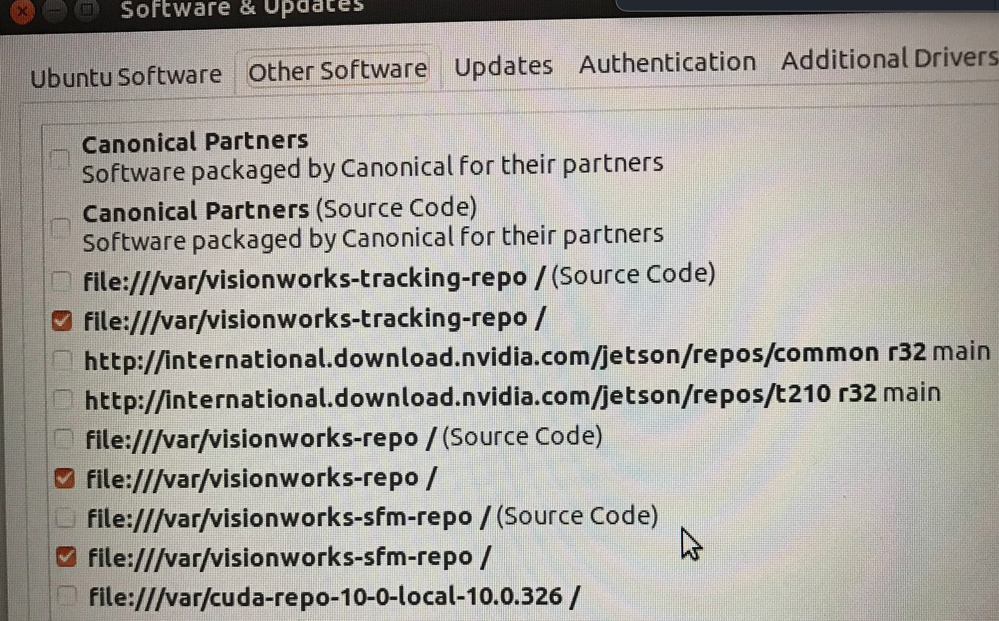

# How to Upgrade Python on the NVIDIA Nano

The current Jetson Nano image is version 4.6.1.
The Donkey Car software only runs on 4.5.1

There are several bugs with the Donkey Car system that do not run on Jetson Nano 4.5.2. So how do we get the latest good stuff without allowing the system to automatically update to 4.5.2?

!!! Warning
    Do not run these commands!
    
    ```sh
    sudo apt-get update -y
    sudo apt-get upgrade -y
    ```

When the command ```sudo apt-get upgrade -y``` is sent, the JetPack dependency tree tries to upgrade to Jetpack version 4.5.2 which will cause the JetPack to lock up when it tries to boot into the Ubuntu Desktop.  Note, this is a bug in the NVIDIA code, not the Donkey Car code.

We should never run ```sudo apt-get update -y``` or ```sudo apt-get upgrade -y ``` when running JP4.5.1.

The following is how we upgrade Ubuntu, but keep JP from attempting to upgrade to JP4.5.2:

1. Once the Desktop has opened, select "System Settings" (the Gear with the wrench on top), then select "System & Updates".
2. When "System & Updates" has opened, select the "Other Software" Tab.
3. When the "Other Software" Tab opens, starting from the top, uncheck boxes that reference the Jetpack and CUDA libraries - 3, 6, and 7, then select "close".
4. Unchecking those boxes prevents the "Software Updater" from updating JP to 4.5.2, but allows Ubuntu and other software to update.



!!! warning

    Always use the "Software Updater GUI" to update your Ubuntu and never run ```sudo apt-get upgrade -y```.

After completing the above process, let the Desktop stay open for a while and the "Software Updater" will appear.

Let the "Software Updater" update Ubuntu whenever you use the Desktop. 


## References

* [Jetson Hacks](https://jetsonhacks.com/2023/06/12/upgrade-python-on-jetson-nano-tutorial/)