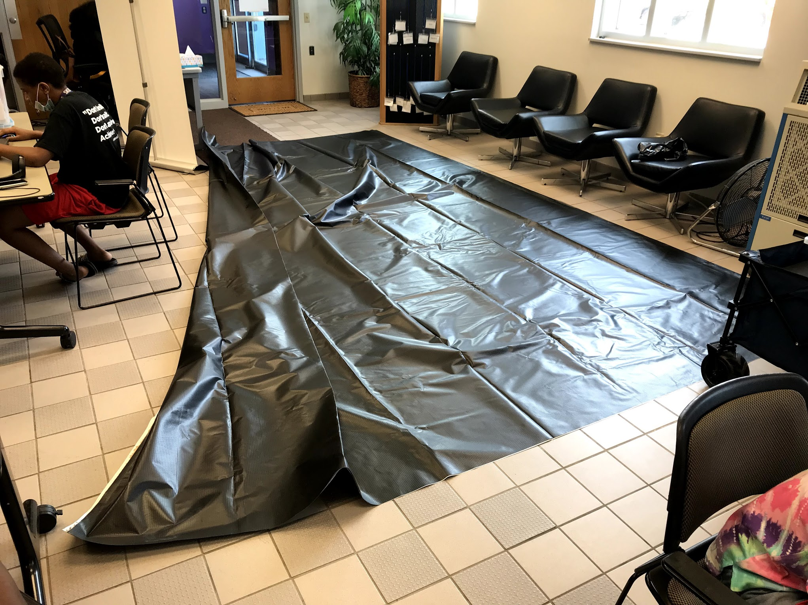
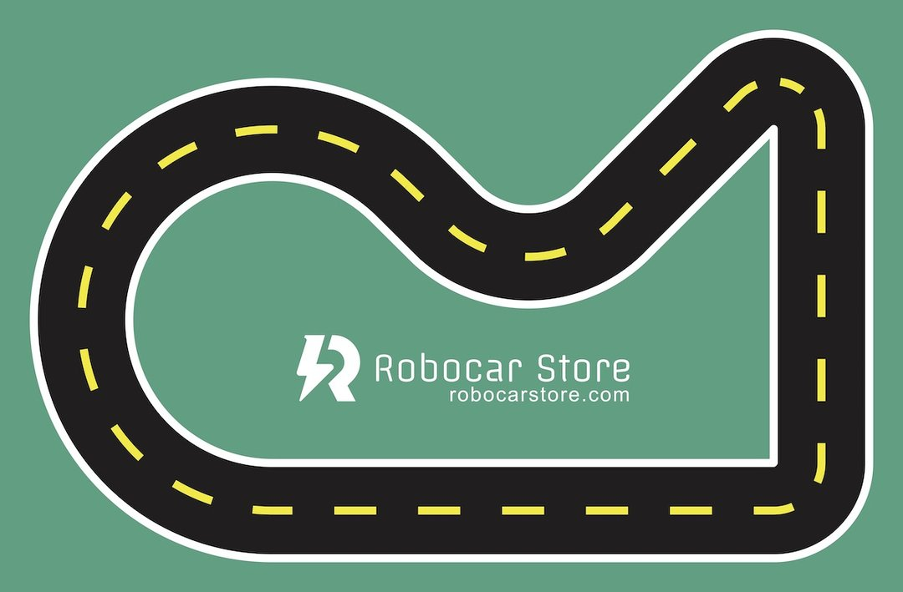
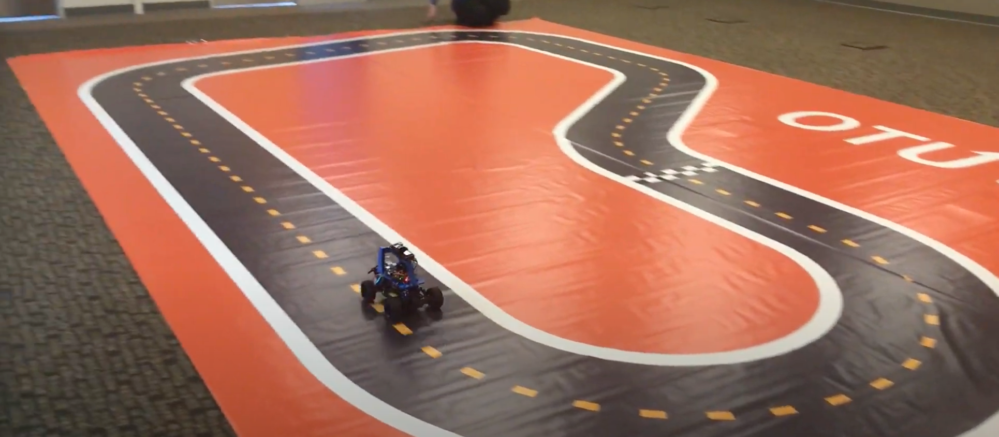

# Track Options

In Minnesota, [Billboard Tarps](https://billboardtarps.com/product-category/billboard-vinyl/) sells used vinyl sign material.  For around $70 you can get a 16' X 25' used black billboard vinyl sign that is ideal for creating your own track.

[Billboard Tarps and Vinyl](https://billboardtarps.com/product-category/billboard-vinyl/) - We suggest you get a dark color (black or dark blue) and then tape down white edges and a yellow dashed line in the center.

Above is a sample of a tarp purchased from Billboard Tarps.  Note the actual track is twice this size since it is still folded in half in this photo.

