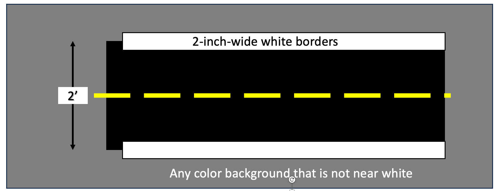
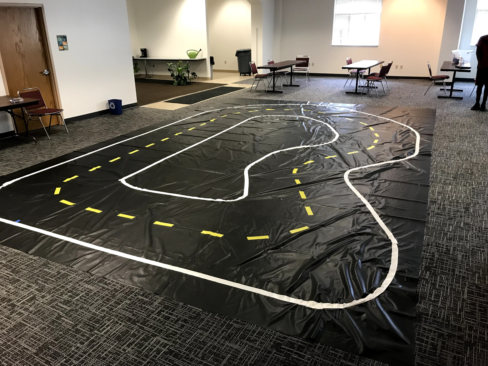
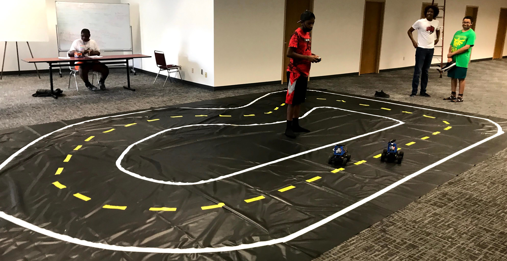
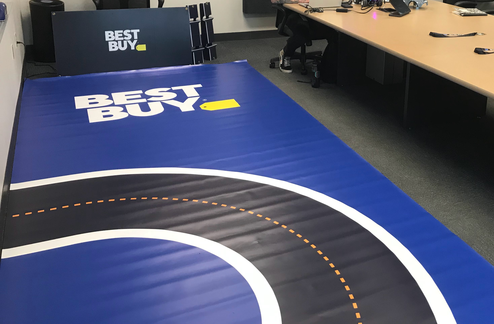
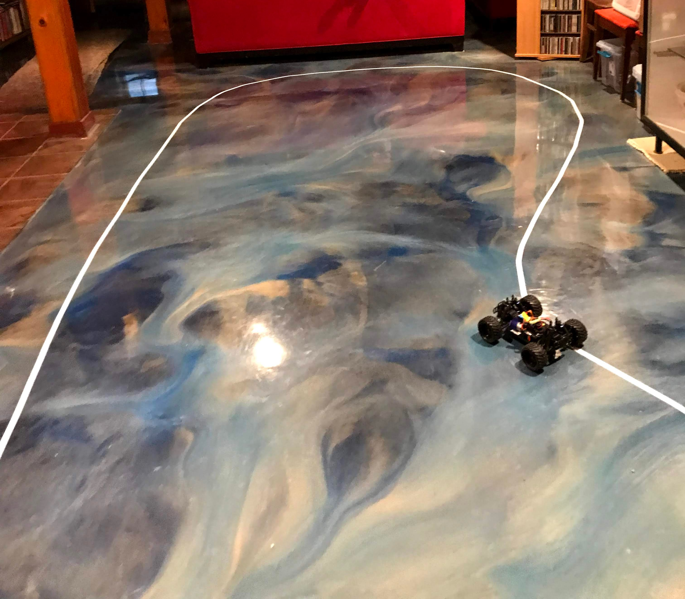

# Track Options

Although you can just put tape down on a floor, that is time-consuming and is often a low-quality track.   There are several other options and the prices vary from under $100 to $1,300.

In Minnesota, [Billboard Tarps](https://billboardtarps.com/product-category/billboard-vinyl/) sells used vinyl sign material.  For around $70 you can get a 16' X 25' used black billboard vinyl sign that is ideal for creating your own track.

[Billboard Tarps and Vinyl](https://billboardtarps.com/product-category/billboard-vinyl/) - We suggest you get a dark color (black or dark blue) and then tape down white edges and a yellow dashed line in the center.

## Picking the Right Size

The typical dimensions of a full-event track is 22 x 34 feet. These dimensions are based on the [DIYRobocars Standard Track](https://www.robocarstore.com/products/diyrobocars-standard-track), which is a popular track for donkey car racing.

The smaller track is a good option for beginners, as it is easier to navigate and control. The larger track is a better option for experienced drivers, as it offers more challenges and opportunities for speed.

Of course, the dimensions of a donkey car track can vary depending on the specific design. However, the dimensions listed above are a good starting point for anyone who is planning to build or race a donkey car.

## Keeping A Standard Width

The standard width of all the "road" tracks is two feet or 24 inches.  This is the distance to the centerline of the white edges.  The roads
are typically black with a white edge and a dashed yellow line down the middle of the track.  The key is to have a high contrast between the
black road and the white edges.

Many people use 2" (or 1 and 7/8") inch wide duct tape or Gaffers tape.
Gaffer's tape is often preferred for temporary events on carpet.
Gaffer's tape doesn't harm the surface to which it adhered.

## Minnesota STEM Partners Tracks

Below is a sample of a tarp purchased from Billboard Tarps.  Note the actual track is twice this size since it is still folded in half in this photo.

Track setup in the driver training room:

Note that this track does not adhere to the 2-foot wide rule.  This
is sometimes done when you have many students doing practice driving on
the same track.

## Optum Track

Optum printed their own track on a local printer that specialized in printing large format signage.  The custom printing cost was about $1,300.00

## Best Buy Track

Best Buy also printed its own track for their events.  This photo only shows about 1/3 of the track.

## Dan McCreary's Basement Track

This track is just a single piece of white electrical tape.

## Interlocking Foam Mats

You can also purchase interlocking foam mats. These are typically two feet by two feet and cost about $30 for a package of 6.  Since each package covers 24 square feet and a full track is about 24x36 feet (758 square feet) we can see the cost of 32 packages is around $960.00.

[Interlocking Foam Mats From WalMart](https://www.walmart.com/ip/Yes4All-6-pcs-Interlocking-Exercise-Foam-Mats-Cover-24-sqft-3-8-inch-Black-Color/1301890003)

[Amazon Foam Mats](https://www.amazon.com/AmazonBasics-Exercise-Foam-Interlocking-Tiles/dp/B0719B8HQZ/ref=sr_1_4_acs_sk_pb_2_sl)

## References

[DIYRobocars Standard Track](https://www.robocarstore.com/products/diyrobocars-standard-track)