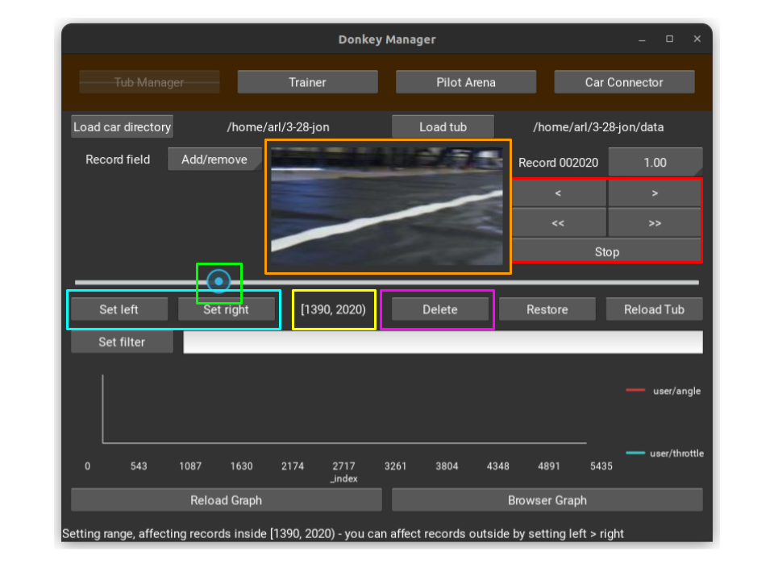

## Appendices

### 1. Trimming Data Tubs

Proper data preparation is essential for training a reliable model. Data tubs contain the collected driving data, but not all data points are useful for training. Here’s how to trim data tubs to enhance model training:

- **Reviewing Data:** Use the Donkey Car management tool to review the images and corresponding driving data collected during your sessions.
- **Identifying Useful Data:** Look for data that represents good driving behavior. Remove any images or sequences where the car is off-track, stationary without purpose, or involved in a collision.
- **Trimming Command:** Utilize the command `donkey tubclean --tub <path_to_tub>` to launch a web interface for easier data selection and trimming.

### 2. Developer Install

For those interested in contributing to the Donkey Car project or needing a development setup:

- **Clone the Repository:** `git clone https://github.com/autorope/donkeycar.git`
- **Checkout the Desired Branch:** Typically, `git checkout dev` for the latest features.
- **Install Dependencies:** Navigate to the cloned directory and run `pip install -e .[dev]` to install all necessary dependencies for development.

### 3. Training Configuration

Configuring your training environment and parameters can significantly impact the performance of your AI model:

- **Selecting a Model Type:** Donkey Car supports multiple model architectures. Choose one that fits your project needs, for example, `linear`, `categorical`, or `rnn`.
- **Adjusting Training Parameters:** Modify parameters such as batch size, epochs, and learning rate in the `myconfig.py` file to optimize training.
- **Using a GPU:** If available, configure TensorFlow to utilize a GPU for faster training. Ensure you have the correct drivers and TensorFlow GPU version installed.

### 4. Additional Tools and Techniques

Expanding the capabilities of your Donkey Car project with additional tools and techniques:

- **Simulator:** Use the Donkey Car simulator to test your AI models in a virtual environment before deploying them to a physical car.
- **Advanced Data Augmentation:** Explore advanced data augmentation techniques to artificially expand your dataset and improve model robustness.
- **Community Contributions:** Engage with the Donkey Car community through forums, GitHub, or social media to share insights, ask questions, and collaborate on projects.

### 5. Troubleshooting Common Issues

Encountering and resolving common issues during setup, training, or driving:

- **Dependency Conflicts:** Use virtual environments to isolate your project and avoid conflicts between different versions of dependencies.
- **Model Performance:** If the model performs poorly, consider collecting more diverse data, increasing the amount of training data, or adjusting the model architecture.
- **Hardware Issues:** Regularly check connections, battery levels, and component integrity to ensure reliable operation of your Donkey Car.