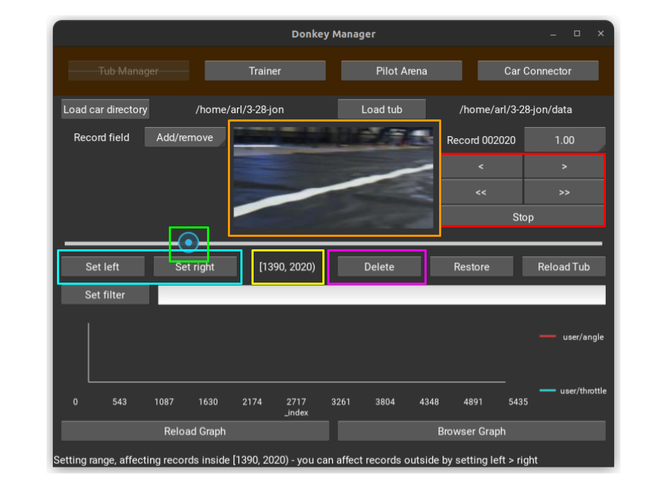

Proper data preparation is essential for training a reliable model. Data tubs contain the collected driving data, but not all data points are useful for training. Here’s how to trim data tubs to enhance model training:

- **Reviewing Data:** Use the Donkey Car management tool to review the images and corresponding driving data collected during your sessions.
- **Identifying Useful Data:** Look for data that represents good driving behavior. Remove any images or sequences where the car is off-track, stationary without purpose, or involved in a collision.
- **Trimming Command:** Utilize the command `donkey tubclean --tub <path_to_tub>` to launch a web interface for easier data selection and trimming.

