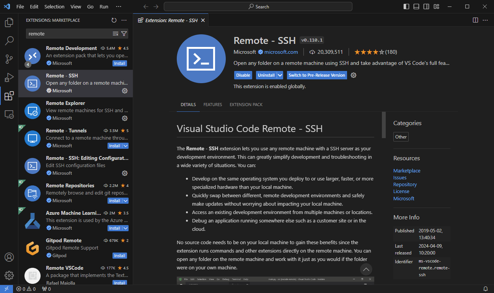
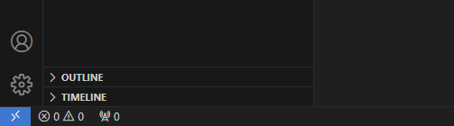
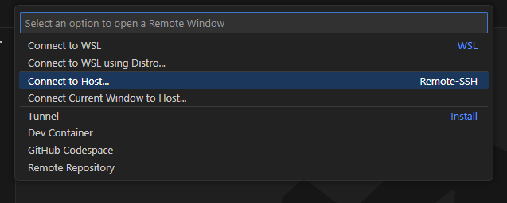
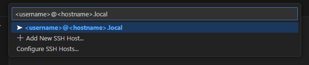

# Visual Studio Code Remote

[Visual Studio Code](https://code.visualstudio.com/) is a free text editor with useful features and extensions for nearly any kind of software development. One such extension is [Remote - SSH](https://code.visualstudio.com/docs/remote/ssh).

As mentioned on the [Networking](../networking.md) page, SSH allows you to access your Raspberry Pi's command line remotely (from your own laptop/PC). The Remote - SSH extension pushes this further by allowing you to open folders, edit files, use the integrated terminal, and take full advantage of VS Code.

# Installation

1. Install [VS Code](https://code.visualstudio.com/)
2. Open the Extensions tab on the left sidebar and search for Remote - SSH
3. Install the extension


# Connect to Your Car

1. Verify that you can SSH into your car from the command line:
```
ssh <username>@<hostname>.local
```
2. In VS Code, select the blue "Open a Remote Window" button in the bottom left corner.

3. Select "Connect to Host"

4. Enter your Raspberry Pi's username and hostname

5. Once connected, you can access your Raspberry Pi's file system and interact using the integrated terminal!