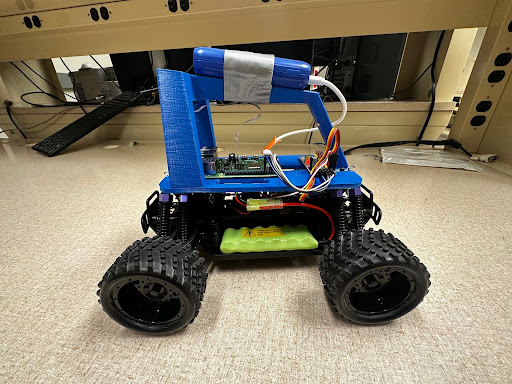
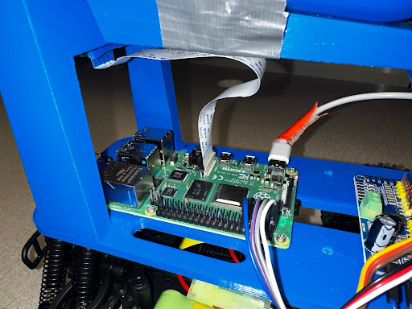
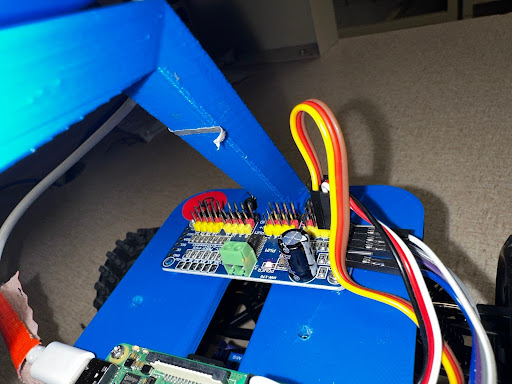
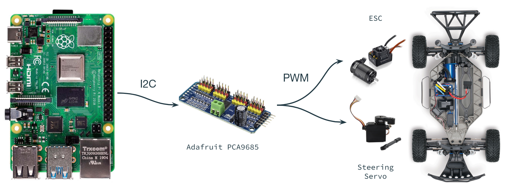
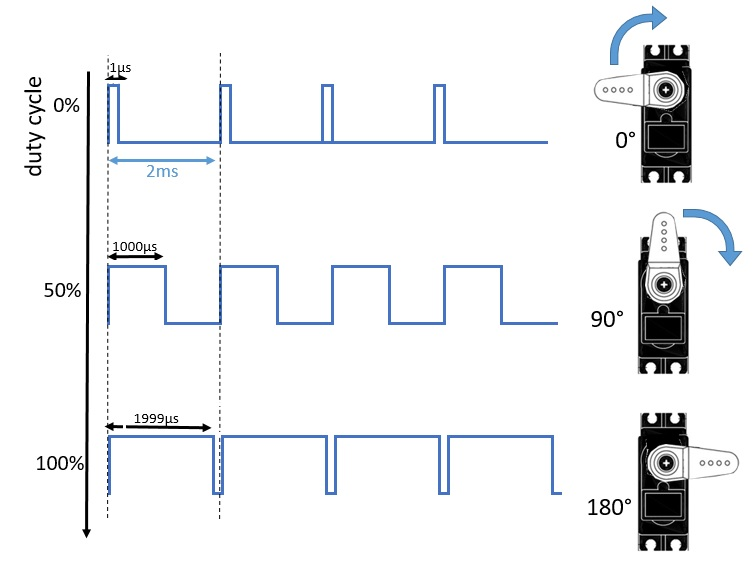
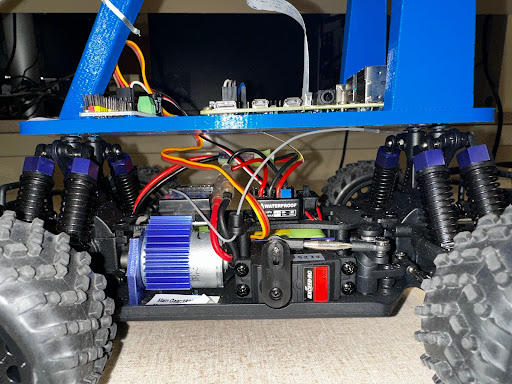
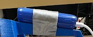
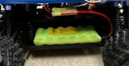
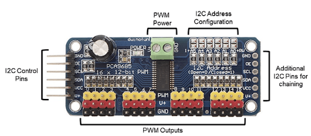

Welcome to Donkey Car! The first section of this curriculum will
familiarize you with each of the components of the pre-assembled car and
how they interact, and prepare you for the minimal hardware setup that
may be required.

## Donkey Car Parts

There are four main components to be concerned with.

### The Raspberry Pi

The Raspberry Pi 4 Model B is mounted to the top of the car, and it acts as the brain
of the car. It is responsible for communicating between itself, the
controller, and your devices. It also sends driving signals to the PWM board,
which we will explore next. It records data through the camera, and it’s
where you will eventually upload your trained model for the car to drive
itself!

### The Pulse Width Modulation Board (PWM)

The Adafruit PCA9685 is responsible for communication between the Raspberry Pi and
the electronic speed controller (ESC) and steering servo. The Pi communicates with the Adafruit board using a protocol called I2C. From there, the Adafruit board sends bursts of square waves with varying duty cycles (called a PWM signal) to the ESC and servo.

### The Motor and Servo

The motor and servo are fairly simple components which shouldn't need much setup (remember to flip the "ON" switch on the ESC!). The motor spins the wheels at a rate according to the PWM signal it received. The steering servo does the same, and rotates an arm to turn the wheels.

### The Power System

Two separate batteries are powering different items in the car. Since
the Raspberry Pi operates at 5 volts, a small portable battery affixed
to the top of the car powers it via a USB Type C cable.

The second battery powers the servo and motors, which operate at 7.2
volts. This battery is plugged into the car and placed to the side in a
small section designed for it to sit.

**IMPORTANT NOTE:** Unlike the portable battery, it matters which way
you plug this battery in. The red wire should connect to the red wire,
and the black wire will connect to the black wire. The wire clips
generally restrict you from connecting it the wrong way, but it can
still be connected with enough force. This will cause irreversible
damage to the battery and potentially damage the motor and servos. This
is especially important when plugging in the battery to charge.

## Hardware Setup

There should be little to no hardware setup, save from connecting a few
wires if they are not already. The wires will connect the PWM and the
Raspberry PI

### Wiring Diagram

Sometimes the cars given to you will be correctly wired and set up for
you. If, for some reason, it isn’t, or if you’d like to change it,
here's how.

Typically, the motor is connected to PWM Pin 0, or the far left
red-white-black pins. The servo is most often connected to PWM Pin 1,
one column to the right of Pin 0. These pins can be specified in
myconfig.py under:

1.  `PWM_THROTTLE_PIN`

2.  `PWM_STEERING_PIN`

By default, these are set to pins 0 and 1, respectively

1.  `PCA9685.1:40.0`

2.  `PCA9685.1:40.1`

If they are moved to any other pin, simply read the number above the
desired column of pins on the PWM and adjust the value accordingly, i.e.
if the motor is connected to the farthest right column of pins, column
\#15, you would update `myconfig.py` the following way:

1.  "`PWM_THROTTLE_PIN`": "`PCA9685.1:40.15`"

You must also connect the GND, SDA, SCL, and V+ and lines of the PWM

Figure 1: PCA 9685 16-Channel Servo Driver

-   Most cars are set for the throttle wire output to be in PWM output 0
    and the steering output to be in PWM output 1. If this is not the
    case look at the PWM

-   `donkey calibrate --pwm-pin=PCA9685.1:40.0` (throttle)

-   `donkey calibrate --pwm-pin=PCA9685.1:40.1` (steering)

-   These pins are also the default in `myconfig.py` under
    `PWM_STEERING_THROTTLE`

-   Set `USE_JOYSTICK_AS_DEFAULT=True`, don’t need to pass `--js`