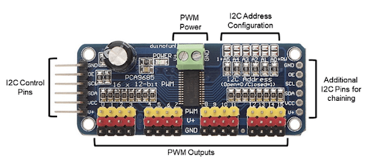

## Step 1: Connecting to Your Car

**Objective**: Our first task is to create a digital conduit through
which your computer will communicate with your miniature autonomous
vehicle, facilitating commands and data exchange.

### **Procedure**

1.  **Secure Connection Establishment**: Utilize SSH (Secure Shell) to
    establish a secure command line interface with your vehicle's
    computing unit, the Raspberry Pi. Detailed instructions for this
    process can be found under the "Networking" section.

2.  **Creating the Project Directory**:

    1.  Execute the command: `donkey createcar --path ~/mycar`
    ```bash title="Create Donkey Car Project Directory"
    donkey createcar --path ~/mycar
    ```
    

    2.  This action constructs a dedicated project directory for your
        vehicle, organizing essential files and configurations necessary
        for its operation.

### **Directory Structure Overview**:

Upon completion, the project directory will comprise several critical
components:

-   `mycar/`: The root directory.

    -   `data/`: Contains captured imagery and metadata from driving
        sessions, acting as the vehicle's experiential memory.

    -   `models/`: Stores machine learning models that enable autonomous
        navigation, essentially forming the vehicle's "cognitive"
        abilities.

    -   `logs/`: A repository for operational logs, useful for
        troubleshooting and performance analysis.

    -   `config.py` & `myconfig.py`: Configuration files for project
        defaults and personalized settings, respectively. While
        config.py remains standard, myconfig.py is where specific
        adjustments and preferences are defined.

    -   `calibrate.py`, `manage.py`, `train.py`: Specialized scripts for
        calibration, management, and training processes, though they are
        not directly interacted with at this stage.

**Customization Note**: While mycar is the suggested name for
simplicity, you may choose any directory name that suits your project's
identity.

**Power Requirements**: Ensure that the vehicle's Raspberry Pi is
adequately powered via a portable battery and that the car itself is
powered by an appropriate RC battery. Verify that any switches on the
electronic speed controller (ESC) or servo are in the 'on' position to
enable operation.

## Step 2: Preparing for Calibration

Calibration is a fancy term for making sure your car understands how to
move correctly when you tell it to. Before we start, place your car on a box or a similar object so the wheels are in the air. This way, it won't drive away during calibration.

**About Your Car's Controls**:



Your car uses something called a PCA 9685 Servo Driver to control its
wheels. Imagine it as the car's steering wheel and gas pedal. Normally,
the "gas pedal" is connected to output 0, and the "steering wheel" to
output 1. If yours is different, you'll need to adjust the instructions
accordingly.

## Step 3: Connecting A Joystick Controller to the Donkey Car

**Why use a joystick?** If you've ever played video games, you know how
intuitive a joystick can be for controlling movement. We can apply this
same intuitive control to our Donkey Car project, allowing for more
precise and responsive control compared to using a web interface.

**Choosing the right controller**: Not all controllers are created
equal, and the steps to connect them can vary. However, most controllers
that connect via a USB adapter will follow a similar setup process.
We'll be using the Logitech F710 as our example, but if you have a
different controller, check the Donkey Car documentation for specific
instructions.


### **Getting Started with the Logitech F710 Controller**

1.  **Prepare the Controller:**

    1.  Ensure your Logitech F710 controller has fresh/charged batteries
        installed.

    2.  If it comes with a USB adapter (a small plug that connects to
        your computer or Raspberry Pi), make sure it's on hand.

2.  **Connect to the Raspberry Pi:**

    1.  Plug the USB adapter into a USB port on the Raspberry Pi. This is how the
        controller will communicate with the car.

3.  **Configure the Settings:**

    1.  Locate the file named `myconfig.py` on your Raspberry Pi. This
        file contains various settings for your Donkey Car.

    2.  Find the section labeled "Joystick" and make the following
        changes:

        1.  Uncomment (remove the \# symbol from the start of) the line
            `USE_JOYSTICK_AS_DEFAULT = True`. This tells the system to
            use the joystick as the primary control method.

        2.  Change `CONTROLLER_TYPE` to `F710` to specify which
            controller you're using.

4.  **Pairing the Controller (If Needed):**

    1.  Some users have reported issues when first trying to pair their
        F710 controller with the USB dongle. If this happens, you'll
        need to use Logitech's Pairing Utility to fix the connection.
        Here's how:

        1.  Attach the USB dongle to your computer (not the Raspberry Pi
            for now).

        2.  Download and open Logitech's Pairing Utility software.

        3.  Follow the on-screen instructions to pair the dongle with
            the controller.

        4.  Once paired successfully, reconnect the dongle to the
            Raspberry Pi.

## Step 4: Calibrating Throttle and Steering


In this step, we're going to learn how to control the car's speed and
direction. This might sound complex, but it's really about telling the
car how fast to go and where to turn. We'll use some special commands
and adjustments to do this, like tuning a musical instrument to get the
right notes.

### Speed Control: Making Your Car Move

1.  **Starting the Calibration Process:**

    1.  First, we need to start the calibration for your car's speed. On
        your computer, type the command `donkey calibrate --pwm-pin=PCA9685.1:40.0`. This command wakes up your car's speed
        control system and gets it ready for tuning.
        
        ```bash title="Calibrate ESC"
        donkey calibrate --pwm-pin=PCA9685.1:40.0
        ```
        

2.  **Finding the Neutral Speed:**

    1.  The program will give you instructions to find the neutral
        speed - this is the speed setting where the car doesn't move at
        all. It's like finding the point where your car is on but
        standing still. You'll try setting it to 370. If the car stays
        still, that's your neutral setting.

3.  **Testing Movement:**

    1.  Now, let's make the car move. Set the speed to 400 to move
        forward. To reverse, try 330. It's a bit like pressing the gas
        pedal: higher numbers to go forward, lower numbers to back up.

4.  **Fine-Tuning Speed:**

    1.  You might need to adjust these numbers a little (about plus or
        minus 10) to find the perfect speeds for moving forward and
        backward. It's like adjusting the volume on your music player to
        get it just right.

5.  **Saving Your Settings:**

    1.  Once you've found the best speeds, you'll save them in a file
        named `~/mycar/myconfig.py` on your computer. Look for the section
        `PWM_STEERING_THROTTLE` and add your numbers for moving forward,
        staying still, and reversing. You'll remove the \# symbol from
        in front of these lines to make sure the car uses these new
        settings.

### Direction Control: Steering Your Car

1.  **Starting Steering Calibration:**

    1.  Similar to speed, we begin calibrating steering by typing `donkey calibrate --pwm-pin=PCA9685.1:40.1`. This gets your car's
        steering system ready for tuning.

        ```bash title="Calibrate Servo/Steering"
        donkey calibrate --pwm-pin=PCA9685.1:40.1
        ```
        

2.  **Adjusting Steering:**

    1.  Start with the wheels pointing straight ahead with a setting
        of 360. Then, try adjusting this number by adding or
        subtracting 10. Your goal is to find out how much you can turn
        the wheels without them making a continuous buzzing noise, which
        means they're trying to turn too far.

3.  **Saving Steering Settings:**

    1.  Just like with speed, you'll update the `~/mycar/myconfig.py` file
        with your steering adjustments. You'll specify values for
        turning left and right. Remember to remove the \# symbol from
        these lines to activate them.

Through these steps, you're not just learning how to make a car move and
turn. You're learning about calibration, which is a key concept in many
areas of technology and engineering. It's all about making small
adjustments to get things working just right, whether it's a toy car or
a real-life project in computer science or robotics.

## Step 5: Final Adjustments

Now, it's time to see how well your car drives:

-   Place the Donkey Car on level ground and make sure it's got space to
    move.

-   Run `python manage.py drive –js` and open
    `http://<hostname>.local:8887` on a browser after the
    terminal prompts you to see through your car's camera.
    
    ```bash title="Drive the Donkey Car"
    python manage.py drive –js
    ```

-   Start with pressing up on the joystick to move forward. If the car
    veers off straight, adjust the PWM values as instructed, then test
    again until it moves straight.

-   Ensure `USE_JOYSTICK_AS_DEFAULT` is uncommented and set to `True` in your `myconfig.py`
    file for easier control in the future.

And that's it! You've now calibrated your car. Remember, this is a process of trial and error, so take
your time and enjoy the learning experience.